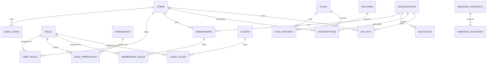

| `/provisioning` | Import and export the access model |# Kimlik: Project Design Document

> **Status:** Draft for review · **Last updated:** 2026-10-07 · **License:** Apache-2.0

Kimlik ("identity" in Turkish) is an open-source, self-hosted identity and access management server. Deploy one container next to PostgreSQL and your application gets:

- a standards-compliant OpenID Connect provider with multi-factor authentication
- user and organization management
- role-based access control
- plans and entitlements
- service clients, API keys and webhooks
- an admin panel and a .NET SDK

This document records the product vision, scope, architecture and engineering conventions to agree on before development starts. After approval, significant changes are recorded as ADRs in `docs/adr/`.

## Contents

1. [Vision](#1-vision)
2. [Decision summary](#2-decision-summary)
3. [Core concepts](#3-core-concepts)
4. [Scope](#4-scope)
5. [Key flows](#5-key-flows)
6. [Architecture](#6-architecture)
7. [Data model](#7-data-model)
8. [Protocol and token design](#8-protocol-and-token-design)
9. [API design](#9-api-design)
10. [Security](#10-security)
11. [Non-functional requirements](#11-non-functional-requirements)
12. [Developer experience and SDK](#12-developer-experience-and-sdk)
13. [Deployment and operations](#13-deployment-and-operations)
14. [Engineering conventions](#14-engineering-conventions)
15. [Technology stack](#15-technology-stack)
16. [Roadmap](#16-roadmap)
17. [Open questions and risks](#17-open-questions-and-risks)

---

## 1. Vision

### 1.1 Problem

Almost every new application rebuilds the same identity plumbing: sign-up and sign-in, password resets, roles and permissions, tokens, service-to-service authentication, subscription plans and API keys. The work is repetitive, easy to get subtly wrong, and critical to security. Teams either spend weeks building it or adopt a heavyweight identity provider and still write authorization and plan management themselves.

### 1.2 Solution

Kimlik is a ready-to-run identity server that handles both **authentication** and **authorization** for one application:

- A full OpenID Connect provider (OAuth 2.x authorization server) with hosted sign-in pages that can be themed.
- Users, organizations, roles, permissions, plans and entitlements, all managed in one place.
- Tokens that any stack can validate, plus a .NET SDK that reduces integration to a few lines of code.

### 1.3 Target users

| Persona | Needs |
|---|---|
| **Application developer** (primary) | Add sign-in, roles, permissions and plans to a new application in hours, and protect APIs with standard JWT validation. |
| **Operator / administrator** | Manage users, organizations, roles, plans and clients from an admin panel, and audit what happened. |
| **End user** | Sign up, sign in with a password or a social account, recover access, and manage their account and organizations. |

### 1.4 Positioning

The identity space already has strong products: Keycloak (Java), Zitadel and Ory (Go), Logto (TypeScript), and SaaS offerings such as Auth0 and Clerk. The .NET ecosystem has no open-source, ready-to-run equivalent:

- Duende IdentityServer is commercially licensed.
- OpenIddict describes itself as a framework, not a turnkey product.
- ABP's identity module is tied to the ABP framework.

Kimlik stands out in four ways:

1. **.NET-native and lightweight.** It needs one container and PostgreSQL. There is no JVM, and no cache or message broker is required.
2. **Authorization is built in, not just authentication.** It covers permissions, global and organization-scoped roles, and plans with features and limits.
3. **Standards first.** OpenID Connect and OAuth are implemented through OpenIddict, so applications in any language can consume Kimlik tokens.
4. **Developer experience.** It ships with sensible defaults, a provisioning file for configuration as code, a .NET SDK and clear documentation.

### 1.5 Non-goals

- Processing payments or managing invoices. External billing systems update subscriptions through the API.
- Hosting several isolated applications (realms or tenants) in one installation. One installation serves one application, and separate products use separate installations.
- LDAP or Active Directory user federation.
- Relationship-based or attribute-based authorization engines in the style of Zanzibar or OpenFGA. Kimlik provides RBAC with organization scoping.

---

## 2. Decision summary

Decisions agreed during the initial brainstorming on 2026-10-07:

| Topic | Decision |
|---|---|
| Product model | Full OpenID Connect provider with hosted sign-in pages. Interactive clients use authorization code + PKCE. |
| Installation scope | One installation serves one application: one user pool, one permission catalog, many clients. |
| User structure | Individual users with optional organizations. A user can belong to many organizations, with different roles in each. |
| Plans | Plans with entitlements (features and limits). No payment processing. |
| Protocol engine | OpenIddict 7.x (Apache-2.0). |
| Credential management | ASP.NET Core Identity for users only. Roles are Kimlik's own model. |
| MVP sign-in methods | Email + password, and social login (Google, Microsoft, Apple, GitHub). |
| Multi-factor authentication | In the MVP: TOTP authenticator apps and recovery codes. Required for administrators by default; can be enforced for the whole installation or per organization. |
| MVP platform features | Admin panel, .NET SDK, API keys, webhooks. |
| Admin panel | Blazor. |
| License | Apache-2.0. |
| Language | English for code, API, documentation and commits. Hosted pages and emails are localized in English and Turkish. |
| Documentation | Markdown in the repository (`docs/`), with ADRs for later decisions. |
| Platform | C# 14, .NET 10 (LTS), ASP.NET Core 10, EF Core 10, PostgreSQL. |

---

## 3. Core concepts

| Concept | Definition |
|---|---|
| **User** | A person who can sign in. All users live in the installation's single user pool. |
| **Organization** | An optional group of users, such as a company, workspace or team. |
| **Membership** | A user's participation in an organization. It carries the user's organization-scoped roles. |
| **Permission** | An atomic capability defined by the application, written as `resource:action` (for example `invoices:read` or `projects.members:invite`). |
| **Role** | A named set of permissions. *Global* roles are assigned to users and service clients directly. *Organization* roles are assigned through memberships. |
| **Feature** | An entitlement defined by the application. It is either a *boolean* feature (`export_pdf`) or a numeric *limit* (`max_projects`). |
| **Plan** | A named set of feature values, such as Free, Pro or Enterprise. |
| **Subscription** | The assignment of a plan to a subscriber (a user or an organization), with a status and a period. |
| **Client** | An application that requests tokens. Clients are either public (SPA, mobile, desktop) or confidential (server-side web app, service). |
| **Service client** | A confidential client that uses the client credentials grant. It holds global roles, so its tokens carry permissions the same way a user's tokens do. |
| **API resource** | An API protected by Kimlik tokens. It is identified by an audience and exposed as a scope. |
| **API key** | A long-lived secret issued to a user or an organization for calling the application's API. It is limited to a set of permissions. |
| **Webhook endpoint** | A URL in the application that receives signed event notifications. |
| **Audit event** | An immutable record of a security-relevant action. |
| **System permission** | A permission in the reserved `kimlik.` namespace (for example `kimlik.users:write`). System permissions grant access to Kimlik's own Management API and admin panel. |

**Key formats.** Permission keys match `^[a-z][a-z0-9_-]*(\.[a-z][a-z0-9_-]*)*:[a-z][a-z0-9_-]*$`. Role, feature and plan keys match `^[a-z][a-z0-9_-]{0,63}$`. The `kimlik.` prefix for permissions and the `kimlik-` prefix for roles are reserved.

---

## 4. Scope

### 4.1 MVP

**Authentication (hosted pages)**

- Sign-up with email and password. The registration mode is open, invite-only or disabled.
- Email verification, forgot password, password reset and password change.
- Password policy with a configurable minimum length (default 12) and no composition rules by default. Account lockout after repeated failures, rate limiting per network address, and a per-account cooldown on account emails.
- Social login with Google, Microsoft, Apple and GitHub, with safe account linking ([§10.3](#103-social-login-and-account-linking)).
- Multi-factor authentication with TOTP authenticator apps (RFC 6238) and single-use recovery codes. MFA applies after every primary sign-in method, including social login.
- MFA policies: optional for users, required for administrators by default, and enforceable for the whole installation or per organization. Users who fall under a requirement enroll during sign-in.
- An optional "remember this browser" period that skips the second factor on trusted browsers. It is configurable and disabled for administrators by default.
- Single sign-on session, "remember me", and RP-initiated sign-out.
- A consent screen for third-party clients. First-party clients skip consent.
- An organization picker for clients that require an organization context.
- Account pages for profile, password, two-factor authentication, connected social accounts, active sessions and account deletion.
- Localization in English and Turkish. Theming through configuration: product name, logo, primary color and custom CSS.

**OpenID Connect / OAuth (OpenIddict)**

- Discovery, JWKS, authorization, token, userinfo, end-session, introspection and revocation endpoints.
- Grants: authorization code with PKCE, refresh token and client credentials.
- Refresh token rotation with reuse detection.
- JWT access tokens (RFC 9068), signed with keys that Kimlik manages ([§8.6](#86-keys-and-secrets)).
- Client presets: SPA, native/mobile, web app and service.

**Users**

- Create, read, update, search, list and delete users. Suspend and reactivate them.
- Mark an email as verified, trigger a password reset, reset MFA for a user who lost their device, view and revoke sessions, and view linked logins.
- Public and private metadata (JSON) per user.

**Organizations**

- Create, update and delete organizations, each with a unique slug and metadata.
- Memberships with organization roles. Invitations by email, which can expire, be resent and be revoked. Members can leave an organization.
- The active organization is carried in tokens ([§8.5](#85-organization-context)).
- Organization admins can manage their organization through the Account API, gated by organization-scoped system permissions.

**Access control**

- A permission catalog containing the application's permissions plus the reserved system permissions.
- Global and organization roles. Roles can be assigned to users, memberships and service clients.
- Effective permissions are embedded in access tokens.
- Default roles for new users and for organization creators.
- A built-in `kimlik-admin` role. Custom administrative roles can be built from subsets of system permissions.

**Plans and entitlements**

- A feature catalog (boolean features and limits), and plans that set a value for each feature.
- Subscriptions for users or organizations with the statuses `trialing`, `active`, `canceled` (still active until the period ends) and `expired`. Each subscription can hold an external billing reference and keeps its history.
- A default plan for new users and new organizations. Subscriptions expire automatically.
- An entitlements API and a `plan` claim in tokens.

**Service clients and API keys**

- Service clients with a client secret and global roles. The secret can be regenerated.
- API keys owned by a user or an organization. A key is shown once, stored hashed and scoped to a set of permissions. It can have an expiry date, tracks when it was last used, and can be revoked. Resource servers check keys through a verification endpoint.

**Webhooks**

- Endpoints with event filters and secrets, signed according to the Standard Webhooks specification.
- Delivery through a transactional outbox, with retries and exponential backoff.
- A delivery log, manual redelivery and test events.

**Audit log**

- Records sign-in activity, credential changes and administrative changes.
- Queryable in the admin panel and through the API. Retention is configurable.

**Management and Account APIs**

- REST/JSON under `/api/v1`, with an OpenAPI 3.1 document and the Scalar UI.
- The Management API is secured by system permissions, held by admin users or service clients.
- The Account API (`/api/v1/me`) serves signed-in users.

**Admin panel (Blazor)**

- Screens for users, organizations, roles and permissions (with a matrix view), features and plans, subscriptions, clients, API keys, webhooks and deliveries, and the audit log.

**Provisioning (configuration as code)**

- A JSON file that defines permissions, roles, features, plans and clients. It is applied idempotently at startup or through the API, and the current model can be exported back to the same format.

**.NET SDK**

- `Kimlik.AspNetCore` integrates a resource server: JWT and API key authentication, permission and feature requirements, and a current-user accessor.
- `Kimlik.Client` is a typed Management API client that handles tokens automatically.
- A helper for verifying webhook signatures.

**Operations**

- Docker image, Docker Compose example, health checks, OpenTelemetry and database migrations.

### 4.2 Later phases

The backlog, roughly in priority order:

1. Phone number sign-in and SMS one-time codes, through adapters for Netgsm, İleti Merkezi and Twilio. Email sign-in codes and accounts without a password are milestone M10, with links next to the codes in M16 ([§10.5](#105-email-sign-in-codes)), and passkeys, as a sign-in of their own and as the second step, are milestones M9 and M15 ([§10.4](#104-passkeys)).
2. Enterprise SSO per organization: OIDC or SAML federation with Entra ID, Okta or Google Workspace, routed by email domain.
3. Token exchange (RFC 8693). The device authorization grant is milestone M12 ([§8.8](#88-device-authorization)), and admin impersonation, with an `act` claim, is milestone M13 ([§10.6](#106-administrative-security)).
4. Developer-hosted sign-in UI through an interaction API.
5. Hosted or embeddable components for organization management.
6. Per-subscriber entitlement overrides and add-ons, and usage metering.
7. CAPTCHA and bot-protection hooks, and step-up authentication (`acr_values`).
8. Multiple client secrets, DPoP and back-channel logout. `private_key_jwt` and PAR are milestone M14 ([§8.2](#82-grants-and-client-authentication)).
9. Product settings and social providers kept in the database and changed at runtime from the admin panel, the API or the provisioning file.
10. A JavaScript/TypeScript SDK and a Helm chart.
11. OpenID Foundation certification.

### 4.3 Out of scope

Payments, multi-realm hosting, LDAP federation, ReBAC/ABAC engines, and acting as a SAML identity provider.

---

## 5. Key flows

### 5.1 Developer onboarding

1. Run `docker compose up` to start Kimlik and PostgreSQL.
2. Kimlik creates the first administrator from the bootstrap settings.
3. Define permissions, roles, features and plans in a provisioning file, or through the admin panel or the API.
4. Register clients, for example `web` (an SPA), `orders-api` (an API resource) and `billing-worker` (a service client).
5. Protect the API with the SDK:

   ```csharp
   builder.Services.AddKimlik(options =>
   {
       options.Authority = "https://id.example.com";
       options.Audience = "orders-api";
   });

   app.MapGet("/invoices", ListInvoices).RequirePermission("invoices:read");
   app.MapPost("/exports", CreateExport).RequireFeature("export_pdf");
   ```

6. Sign users in from the frontend with any OpenID Connect client library, such as oidc-client-ts, AppAuth or the ASP.NET Core OpenID Connect handler.

### 5.2 End-user sign-in (authorization code + PKCE)

```
App ── GET /connect/authorize?client_id=web&response_type=code
         &scope=openid profile email offline_access orders
         &code_challenge=…&organization=acme ─────────────────▶ Kimlik
Kimlik: no session → hosted sign-in → (second factor) → (organization picker) → (consent, third-party only)
Kimlik ── 302 redirect_uri?code=… ─────────────────────────────▶ App
App ── POST /connect/token (code + code_verifier) ─────────────▶ Kimlik
App ◀── id_token + access_token (JWT) + refresh_token
App ── Bearer access_token ────────────────────────────────────▶ Orders API
Orders API validates the JWT locally using cached JWKS keys.
```

### 5.3 Switching the active organization

- **Standard:** re-authorize with `organization=<id or slug>` and `prompt=none`. The existing SSO session is reused.
- **Kimlik extension:** use the `refresh_token` grant with an `organization` parameter. Kimlik checks the membership again and issues tokens for the new context without a redirect.

### 5.4 Service to service

```
billing-worker ── POST /connect/token (client_credentials, scope=orders) ──▶ Kimlik
billing-worker ◀── access_token carrying the client's permissions
billing-worker ── Bearer access_token ──▶ Orders API
```

### 5.5 API keys

```
Customer ── Authorization: Bearer kmk_… ──▶ Orders API (SDK)
Orders API ── POST /api/v1/api-keys/verify (result cached briefly) ──▶ Kimlik
Orders API ◀── owner, permissions, plan → same ClaimsPrincipal shape as for a JWT
```

The resource server authenticates to Kimlik as a service client holding `kimlik.api_keys:verify`. The SDK handles this automatically.

- **Format:** `kmk_` followed by 256 random bits in base64url. Kimlik keeps the first 12 characters to show and a SHA-256 hash to look the key up; the secret is shown once.
- **Permissions:** only the application's, never `kimlik.*`, and only ones the creator holds: a user their global permissions, an organization member their permissions in the organization (creating organization keys takes `kimlik.org.api_keys:write`).
- **Owner:** a user's key acts for the user and keeps only the permissions the user still holds; it stops working while the user is suspended. An organization's key acts on its own behalf and outlives the member who created it. Owners have at most 100 keys that are not revoked.
- **In the resource server:** the principal looks like one from an access token: `sub` (the user, or the key itself for an organization's key), `permissions`, `org_id`, `plan`, plus `api_key_id`. The SDK caches each verification for 30 seconds by default, so a revoked key can work that much longer.

### 5.6 Plan change from external billing

```
Stripe/iyzico ── billing webhook ──▶ Application backend
Application backend ── PATCH /api/v1/subscriptions/{id} ──▶ Kimlik
Kimlik ── subscription.updated (signed webhook) ──▶ Application backend
The next token refresh carries the new plan claim.
```

---

## 6. Architecture

### 6.1 Overview

Kimlik is a modular monolith: one deployable process, organized internally by feature. PostgreSQL is its only required stateful dependency.

```
                 ┌──────────────────────────── Kimlik.Server ─────────────────────────────┐
 Browser/mobile ▶│ Hosted UI (Razor Pages)        Protocol endpoints (OpenIddict)         │
                 │ /signin /signup /account …     /connect/*  /.well-known/*              │
 Administrators ▶│ Admin panel (Blazor, /admin)                                           │
 App backends   ▶│ Management & Account API (Minimal APIs, /api/v1)                       │
                 │──────────────────────── Application (use cases) ───────────────────────│
                 │──────────────────────── Domain model ──────────────────────────────────│
                 │ Infrastructure: EF Core, Identity & OpenIddict stores, email, outbox,  │
                 │ background workers, caching, key management                            │
                 └───────────────────────────────────┬────────────────────────────────────┘
                                                     │
                                                PostgreSQL

Resource servers (Kimlik.AspNetCore) validate JWTs with cached JWKS keys and verify API keys through the API.
Kimlik delivers signed webhooks to application backends.
```

### 6.2 Solution structure

```
Kimlik/
├─ Kimlik.slnx
├─ global.json · Directory.Build.props · Directory.Packages.props · .editorconfig · compose.yaml
├─ src/
│  ├─ Kimlik.Domain/          Entities, value objects, domain rules and errors
│  ├─ Kimlik.Contracts/       Public API request/response models (shared with the SDK)
│  ├─ Kimlik.Application/     Use cases grouped by feature, ports, authorization checks
│  ├─ Kimlik.Infrastructure/  EF Core/PostgreSQL, Identity & OpenIddict stores, email,
│  │                          outbox, background workers, caching, key management
│  ├─ Kimlik.Admin/           Blazor admin panel (Razor class library)
│  └─ Kimlik.Server/          Host: protocol endpoints, hosted UI, APIs, composition root
├─ sdk/
│  ├─ Kimlik.AspNetCore/      Resource-server integration
│  └─ Kimlik.Client/          Typed Management API client
├─ tests/
│  ├─ Kimlik.Domain.Tests/
│  ├─ Kimlik.Application.Tests/
│  ├─ Kimlik.Server.Tests/    Integration and protocol end-to-end tests (Testcontainers)
│  └─ Kimlik.AspNetCore.Tests/
├─ samples/                   Sample API, SPA and worker
├─ deploy/                    Deployment examples (production Compose, Helm later)
└─ docs/                      Design, ADRs, guides
```

Projects are added when their first code lands, so the solution grows milestone by milestone. M0 contains Infrastructure, Server and Server.Tests.

**Dependency rules** (enforced by architecture tests):

| Project | May depend on |
|---|---|
| Domain | Nothing, except `Microsoft.Extensions.Identity.Stores` for the Identity user base type |
| Contracts | Nothing |
| Application | Domain, Contracts. Also EF Core (without a provider), `Microsoft.Extensions.Identity.Core`, and OpenIddict's abstractions (its managers, for changes) and EF Core entity models (for queries), but never ASP.NET Core or Npgsql. |
| Infrastructure | Application, Domain |
| Admin | Application, Contracts |
| Server | All projects (composition root) |
| Client (SDK) | Contracts |
| AspNetCore (SDK) | Contracts, Client |

**Feature folders** inside the Application project:

```
Kimlik.Application/
├─ Users/
│  ├─ CreateUser.cs        One use case per file: input, handler, mapping
│  ├─ SuspendUser.cs
│  ├─ ListUsers.cs
│  └─ UserErrors.cs
├─ Organizations/
├─ Access/                 Roles and permissions
├─ Plans/
├─ Clients/
├─ ApiKeys/
├─ Webhooks/
├─ Audit/
└─ Common/                 Result, Error, paging, actor context
```

### 6.3 Request handling

1. An endpoint (Minimal API) or a Blazor component receives the input. Shape validation uses the built-in .NET 10 validation (data annotations).
2. A use-case handler checks the actor's permissions, loads aggregates and applies domain logic. Each handler is a plain class that serves exactly one use case.
3. A single `SaveChangesAsync` call commits the state changes, audit events and outbox messages in one transaction.
4. The handler returns a `Result<T>`. The endpoint maps failures to RFC 9457 problem details.

Principles:

- **No mediator library.** Handlers are injected directly. Cross-cutting concerns are written explicitly or applied through endpoint filters.
- **No repositories over EF Core.** `DbContext` is the unit of work. Handlers query through an `IKimlikDbContext` interface, using projections and `AsNoTracking` for reads.
- **Expected failures are results, not exceptions.** Every error has a stable code, such as `user.email_taken`. Exceptions are reserved for bugs and infrastructure failures and are handled globally.
- **Authorization lives in the Application layer.** The admin panel and the Management API share the same checks. Endpoint policies add a second layer.
- **Explicit mapping.** No AutoMapper. Mapping is written by hand next to the use case.

### 6.4 Hosted UI

- Razor Pages, rendered on the server with minimal JavaScript (progressive enhancement).
- Anti-forgery tokens on every form and a strict Content Security Policy with nonces. Pages run no script, except the first-party passkey script on the pages that need it ([§10.4](#104-passkeys)).
- Localization through resource files, and theming through CSS custom properties driven by configuration.
- Accessibility target: WCAG 2.2 AA.

### 6.5 Admin panel

- Blazor in the Interactive Server render mode, with MudBlazor components. The same process serves it under `/admin`.
- It reuses the hosted sign-in session and requires system permissions.
- It calls Application handlers in-process, so business rules and authorization are shared with the Management API.
- It can be disabled per instance (`Kimlik:Admin:Enabled`), for example to expose it only on an internal instance. Multi-instance deployments need sticky sessions for it.
- Every operation runs in a service scope of its own, as the signed-in administrator, after checking the system permission the matching Management API endpoint requires. The circuit rechecks the session every minute: a changed security stamp or lost access ends it.
- Its pages get their own content security policy: Blazor and MudBlazor need scripts from Kimlik and inline styles, which the hosted pages' policy forbids.

### 6.6 Background processing

Hosted services run inside the same process and can be disabled per instance:

- **Outbox dispatcher:** webhooks, emails and cache invalidation.
- **Webhook delivery:** retries failed deliveries.
- **Periodic jobs:** token pruning, subscription expiration, invitation expiry, audit retention and signing key rotation.

PostgreSQL acts as the queue (`FOR UPDATE SKIP LOCKED`), and periodic jobs take advisory locks. Multiple instances can therefore run safely without an external broker or scheduler.

### 6.7 Caching

HybridCache provides an in-memory layer, plus an optional layer on Redis (or a compatible server such as Valkey) for multi-instance deployments.

- **What is cached:** role-to-permission maps, plan entitlements, client metadata and API key verification results.
- **Invalidation:** entries are removed by tag when the outbox processes a change. Without a distributed cache, TTLs limit how stale an entry can get.
- **Exceptions:** security-critical checks (user status, token revocation) always read from the database.

### 6.8 Configuration

- **Infrastructure configuration** comes from standard .NET configuration: `appsettings.json` and environment variables named `Kimlik__Section__Key`. This covers the connection string, master key, SMTP, social provider credentials and bootstrap admin. Options are validated at startup.
- **Product settings** come from the same configuration, in their own sections: branding, registration mode, password and MFA policies, token lifetimes and default plans. Changing one takes a restart. Keeping them in the database, to edit them in the admin panel, the API or the provisioning file, is a later phase ([ADR 0001](adr/0001-product-settings-from-configuration.md)).

### 6.9 Observability

- OpenTelemetry traces, metrics and logs, exported over OTLP.
- Structured logging with source-generated `LoggerMessage`.
- Domain metrics: sign-ins, failures, tokens issued and webhook deliveries.
- Liveness and readiness health checks.

---

## 7. Data model

### 7.1 Conventions

- **Naming:** a dedicated PostgreSQL schema `kimlik`, with snake_case names (EFCore.NamingConventions).
- **Primary keys:** UUIDv7, generated in the application with `Guid.CreateVersion7()`. They are globally unique, time-ordered and index-friendly.
- **Timestamps:** `timestamptz` (UTC), mapped to `DateTimeOffset`. Aggregates have `created_at` and `updated_at`. Time comes from `TimeProvider`.
- **Concurrency:** optimistic, using PostgreSQL's `xmin`.
- **Flexible data:** metadata and other flexible payloads are stored as `jsonb`.
- **No soft delete by default:** deletions are real and history lives in the audit log. Subscriptions keep their history through their status.
- **Secrets:** secrets that only need to be verified are stored as one-way hashes (passwords, client secrets, API keys, invitation tokens, recovery codes). Secrets that must be read back are encrypted with the master key (signing keys, webhook secrets, TOTP secrets).

### 7.2 Entities



`CLIENTS` corresponds to OpenIddict's application entity (`oidc_applications`).

| Area | Table | Key columns and notes |
|---|---|---|
| Identity | `users` | ASP.NET Core Identity columns (email, normalized email, password hash, security stamp, lockout) plus `given_name`, `family_name`, `picture_url`, `locale`, `time_zone`, `status` (active/suspended), `public_metadata`, `private_metadata`, `last_sign_in_at` |
| | `user_logins` | External provider links (`login_provider`, `provider_key`) |
| | `user_passkeys` | Passkeys: credential ID, public key, signature counter, transports, flags, name, creation time |
| | `user_tokens`, `user_claims` | Identity internals: the encrypted TOTP secret, hashed recovery codes and the last accepted TOTP time step |
| Protocol | `oidc_applications`, `oidc_authorizations`, `oidc_scopes`, `oidc_tokens` | OpenIddict entities with UUID keys. A client's type (preset) and first-party flag map onto OpenIddict's own settings (client type, application type, grant types and consent type), so they need no extra columns and cannot drift from them. An API resource is a scope with one audience. |
| Access | `permissions` | `key` (unique), `description`, `is_system` |
| | `roles` | `key`, `name`, `description`, `scope` (global/organization), `is_system`. Unique on (`scope`, `key`). |
| | `role_permissions`, `user_roles`, `client_roles` | Join tables. `user_roles` and `client_roles` accept global roles only. |
| Organizations | `organizations` | `name`, `slug` (unique), `picture_url`, `require_mfa`, metadata |
| | `memberships` | Unique on (`organization_id`, `user_id`) |
| | `membership_roles` | Organization roles only |
| | `invitations` | `email`, `token_hash`, `status`, `expires_at`, `invited_by_user_id`, roles to grant |
| Plans | `features` | `key`, `name`, `type` (boolean/limit) |
| | `plans` | `key`, `name`, `description`, `is_archived` |
| | `plan_features` | `is_enabled` for boolean features, `limit_value` for limits (null means unlimited) |
| | `subscriptions` | `plan_id`, exactly one of `user_id` and `organization_id`, `status`, `current_period_start`, `current_period_end`, `trial_ends_at`, `canceled_at`, `external_reference`. A partial unique index allows one current subscription per subscriber. |
| Keys | `api_keys` | Owner (user or organization), `name`, `display_prefix`, `secret_hash` (unique), `permissions`, `expires_at`, `last_used_at`, `revoked_at` |
| | `signing_keys` | `kid`, `algorithm`, encrypted key material, `activates_at`, `retires_at`, `expires_at` |
| | `data_protection_keys` | ASP.NET Core Data Protection key ring |
| Events | `outbox_messages` | `type`, `payload`, `occurred_at`, `processed_at`, `attempts` |
| | `webhook_endpoints` | `url`, encrypted secret, `event_types`, `is_enabled` |
| | `webhook_deliveries` | `endpoint_id`, `event_id`, `status`, `attempts`, `next_attempt_at`, last response |
| | `audit_events` | `occurred_at`, `action`, actor (type, id), subject (type, id), `organization_id`, `ip_address`, `user_agent`, `correlation_id`, `data` |

---

## 8. Protocol and token design

### 8.1 Endpoints

| Endpoint | Path |
|---|---|
| Discovery | `/.well-known/openid-configuration` |
| JWKS | `/.well-known/jwks` |
| Authorization | `/connect/authorize` |
| Pushed authorization requests | `/connect/par` |
| Token | `/connect/token` |
| UserInfo | `/connect/userinfo` |
| End session | `/connect/endsession` |
| Introspection | `/connect/introspect` |
| Revocation | `/connect/revoke` |
| Device authorization | `/connect/device` |
| Device verification (hosted page) | `/connect/verify` |

### 8.2 Grants and client authentication

- **MVP grants:** `authorization_code` (PKCE with S256 is required for every client), `refresh_token` and `client_credentials`.
- **Device authorization** (RFC 8628, `urn:ietf:params:oauth:grant-type:device_code`) for native clients, such as command-line tools and TV apps ([§8.8](#88-device-authorization)).
- **Not supported:** the implicit and resource owner password grants. The OAuth 2.0 Security Best Current Practice (RFC 9700) deprecates both.
- **Client authentication:** web and service clients authenticate with a secret (`client_secret_basic` or `client_secret_post`) or with keys (`private_key_jwt`, RFC 7523), one or the other. Registering a JWK Set of public signing keys (RSA or EC, at most 10, without private parameters) replaces the secret, and generating a new secret removes the keys. The client signs a short-lived JWT for each request, typed `client-authentication+jwt` (draft-ietf-oauth-rfc7523bis) and with Kimlik's issuer as its audience, so no shared secret leaves the client and no other JWT passes as an assertion.
- **Pushed authorization requests** (PAR, RFC 9126) at `/connect/par`, for every client that signs users in: the client posts the authorization parameters directly, authenticating if confidential, and sends the browser with only the `request_uri` it got back. A client can be set to require PAR (`requirePushedAuthorization`), so its authorization parameters never travel through the browser.
- **Redirect URIs** are matched exactly.

### 8.3 Token formats and lifetimes

| Token | Format | Default lifetime |
|---|---|---|
| Authorization code | Opaque | 5 minutes, single use |
| Access token | JWT (`typ: at+jwt`, RFC 9068), signed, not encrypted | 10 minutes |
| ID token | JWT | 10 minutes |
| Refresh token | Opaque to clients, rotated on every use | 14 days sliding, 90 days absolute |

- Lifetimes are configurable globally and per client.
- Access tokens are short-lived so that changes to roles, permissions and plans propagate quickly without introspection.
- A short reuse window tolerates concurrent refresh requests. Reusing a refresh token outside that window revokes the whole authorization (the token family).

### 8.4 Access token claims

```json
{
  "iss": "https://id.example.com/",
  "sub": "0199c3a2-5b7e-7c41-9d2e-6f1a8b3c4d5e",
  "aud": "orders-api",
  "client_id": "web",
  "scope": "openid profile email offline_access orders",
  "iat": 1791331200,
  "exp": 1791331800,
  "jti": "0199c3a2-6d10-7a8b-b1c2-3d4e5f607182",
  "auth_time": 1791331140,
  "amr": ["pwd", "otp", "mfa"],
  "roles": ["member"],
  "org_id": "0199c3a1-0f2e-7d3c-8b4a-5e6f70819203",
  "org_roles": ["owner"],
  "permissions": ["invoices:read", "invoices:write", "projects.members:invite"],
  "plan": "pro"
}
```

- **`auth_time` and `amr`:** when and how the user authenticated, with RFC 8176 method values such as `pwd`, `otp` and `mfa`, `fed` after a sign-in at another provider, and `pop` for a passkey. Applications can use them to require MFA for sensitive operations. ID tokens carry them too.
- **`roles`:** the user's global roles.
- **`org_id` and `org_roles`:** present when an organization context is active.
- **`permissions`:** the effective permissions for the current context (global roles plus organization roles), deduplicated.
- **`plan`:** the plan key of the active subscriber. That is the organization when `org_id` is present, otherwise the user. The SDK looks up feature values and limits in cached plan definitions, which keeps tokens small.
- **System permissions (`kimlik.*`):** emitted only when the token's audience includes the Kimlik API (`kimlik`).
- **Service-client tokens:** `sub` is the client ID, `permissions` come from the client's roles, and there are no organization claims.
- **ID tokens and UserInfo:** return the standard OIDC claims for the requested scopes (`profile`, `email`).

### 8.5 Organization context

- Clients send `organization=<id or slug>` in the authorization request, and Kimlik checks the membership.
- A client can be configured to require an organization. If it does and the request names none, the hosted UI shows an organization picker, or offers to create an organization, depending on settings.
- The context is stored on the authorization, so refreshed tokens keep it. Switching is described in [§5.3](#53-switching-the-active-organization).

### 8.6 Keys and secrets

- **Master key.** A 256-bit key supplied through configuration. It is required in production; development uses a locally generated key. It encrypts secrets at rest: signing keys, webhook secrets, TOTP secrets and the Data Protection key ring.
- **Signing keys** are generated automatically: RS256 with RSA 3072-bit keys by default, ES256 optionally. They are stored encrypted and rotated on a schedule (every 90 days by default).
  - The next key appears in JWKS before it becomes active.
  - A retired key stays in JWKS until every token signed with it has expired.
  - Operators can supply keys or certificates from files instead.
- **Validation:** milestone M1 includes a spike that confirms rotation works with OpenIddict.

### 8.7 Sessions and sign-out

- The hosted UI keeps an SSO session in a cookie with the `__Host-` prefix and the `Secure`, `HttpOnly` and `SameSite=Lax` attributes.
- RP-initiated logout goes through the end-session endpoint, with registered post-logout redirect URIs.
- Users and admins can list and revoke sessions. Suspending a user revokes all of the user's authorizations and tokens.
- Front-channel and back-channel logout come in a later phase.

### 8.8 Device authorization

Native clients can sign people in from another device (RFC 8628), as command-line tools and TV apps do.

- The client asks `/connect/device` for a code, shows it with the link to `/connect/verify`, and polls the token endpoint. The person signs in on any browser, enters the code unless the link carried it, and allows or denies the device.
- The page always asks, first-party apps included, since the request comes from another device, and it tells people to allow it only if they started signing in there and it shows the same code. A session without the second factor its account needs adds it first.
- An approval is an ad hoc authorization, so it is listed among the user's sessions and can be signed out, and it is audited (`user.device_approved`).
- A native client without a redirect URI uses only this flow. The device flow does not take an organization yet.

---

## 9. API design

### 9.1 Conventions

- **Format:** REST over JSON (System.Text.Json, camelCase) under the base path `/api/v1`. Resource names are plural and paths are kebab-case (`/api-keys`).
- **Values:** identifiers are UUID strings. Timestamps are ISO 8601 in UTC.
- **Pagination:** cursor-based. `?limit=50&cursor=…` returns `{ "items": [...], "nextCursor": "…" }`.
- **Filtering and sorting:** through query parameters (`?status=active&q=ali&sort=-createdAt`).
- **Errors:** RFC 9457 problem details, with a stable `code`, validation `errors` and a `traceId`.
- **Updates:** `PATCH` with JSON Merge Patch semantics (RFC 7396). Optimistic concurrency uses `ETag` and `If-Match`. State transitions get explicit action endpoints (`POST /users/{id}/suspend`).
- **Versioning:** the major version is part of the path, and additive changes are non-breaking. A snapshot test of the OpenAPI document catches accidental breaking changes.
- **Rate limiting:** per network address (IPv6 grouped by /64), answering `429` with `Retry-After`.

### 9.2 Management API (MVP resources)

| Resource | Operations |
|---|---|
| `/users` | List and search, create, get, update, delete, suspend, reactivate, verify email, send password reset, reset MFA |
| `/users/{id}/roles`, `/users/{id}/sessions`, `/users/{id}/logins` | Assign and remove roles, list and revoke sessions, list and unlink logins |
| `/organizations` | List, create, get, update, delete |
| `/organizations/{id}/members`, `/organizations/{id}/invitations` | Add and remove members, change member roles, invite, resend, revoke |
| `/permissions`, `/roles` | Manage the catalog, assign permissions to roles |
| `/features`, `/plans`, `/subscriptions` | Manage the feature catalog and plans; subscribe, change plan, cancel |
| `/entitlements/{subscriberType}/{id}` | Effective features and limits |
| `/clients` | Create (with presets), update, regenerate secret, assign roles |
| `/api-resources` | List, register, describe and delete the APIs that accept Kimlik tokens |
| `/api-keys`, `/api-keys/verify` | List and revoke; verify (for resource servers) |
| `/webhooks/endpoints`, `/webhooks/deliveries` | Manage endpoints, inspect and redeliver |
| `/audit-events` | Query |
| `/provisioning` | Import and export the access model |

Every operation requires a system permission, for example:

- `kimlik.users:read`, `kimlik.users:write` and `kimlik.users:impersonate`
- `kimlik.roles:write`, `kimlik.clients:write` and `kimlik.plans:write`
- `kimlik.subscriptions:write` and `kimlik.organizations:write`
- `kimlik.webhooks:read`, `kimlik.webhooks:write` and `kimlik.audit:read`
- `kimlik.api_keys:read` and `kimlik.api_keys:write`
- `kimlik.api_keys:verify`

### 9.3 Account API (`/api/v1/me`)

- Covers the user's profile, password change, two-factor authentication (enroll, confirm, disable, regenerate recovery codes), sessions, linked logins, organizations and invitations, the user's own API keys, and account deletion.
- Organization self-service is available under `/me/organizations/{id}/members` and `/me/organizations/{id}/invitations`. It is gated by organization-scoped system permissions such as `kimlik.org.members:write`.
- Calls require the `kimlik` scope.

### 9.4 Events

Event names follow `<resource>.<past_tense_verb>`.

- **Webhook events (MVP):**
  - Users: `user.created`, `user.updated`, `user.deleted`, `user.suspended`, `user.reactivated`, `user.mfa_enabled`, `user.mfa_disabled`
  - Organizations: `organization.created`, `organization.updated`, `organization.deleted`
  - Memberships: `membership.created`, `membership.updated`, `membership.deleted`
  - Invitations: `invitation.created`, `invitation.accepted`
  - Subscriptions: `subscription.created`, `subscription.updated`, `subscription.canceled`, `subscription.expired`
  - API keys: `api_key.created`, `api_key.revoked`
- **Audit-only examples:** `user.signed_in`, `user.sign_in_failed`, `user.locked_out`, `user.password_changed`, `user.password_reset`, `user.email_verified`, `user.login_linked`, `user.mfa_challenge_failed`, `user.recovery_code_used`, `user.mfa_reset`, `role.assigned`, `client.secret_regenerated`.

Webhook delivery follows the Standard Webhooks specification (`webhook-id`, `webhook-timestamp` and `webhook-signature` headers, HMAC-SHA256):

- Delivery is at-least-once, so consumers should process events idempotently.
- Failed deliveries are retried with exponential backoff for up to 24 hours (by default after 10 seconds, 1 and 5 minutes, 30 minutes, 2, 6 and 12 hours). Any 2xx answer counts as received; redirects are not followed.
- Endpoints that keep failing are flagged (`failingSince`) until a delivery succeeds.
- Events are thin: `{ "type", "timestamp", "data": { "subjectType", "subjectId", "organizationId", "actor", "details" } }`. They name what changed and leave its current state to the Management API, so delayed or repeated deliveries never carry stale data.
- Each event is the audit event of the change: recording a change whose action is a webhook event type also queues the event in the outbox, in the same transaction, and `webhook-id` is the audit event's ID. A worker fans the event out into one delivery per subscribed endpoint, and senders lease due deliveries with `FOR UPDATE SKIP LOCKED`, so any number of instances share the work.
- Endpoint URLs must use HTTPS, except `localhost` for development, and webhooks only reach public addresses: Kimlik checks the address it connects to, so endpoints cannot point it at its own network, cloud metadata or sidecars (server-side request forgery), even through DNS rebinding. `Kimlik:Webhooks:AllowPrivateNetworks` lifts this for development and internal deployments. Secrets (`whsec_…`) are encrypted with the master key; rotating one takes effect at once.
- A test event (`webhook.test`) can be sent to an endpoint, even a disabled one, and any delivery can be sent again. The delivery log is kept for 30 days.

---

## 10. Security

### 10.1 Baseline

Kimlik uses OWASP ASVS (Level 2) and the OAuth 2.0 Security Best Current Practice (RFC 9700) as design references.

| Threat | Controls |
|---|---|
| Credential stuffing, brute force | Rate limiting per network address, account lockout, generic error messages |
| Inbox flooding through public forms | A per-account cooldown on verification and reset emails, on top of the per-address limits |
| Phished or reused passwords | MFA (TOTP), enforceable for administrators, organizations or the whole installation |
| Account enumeration | Identical responses and comparable timing for sign-up, sign-in and password reset |
| CSRF, XSS, clickjacking | Anti-forgery tokens, output encoding, CSP with nonces, `frame-ancestors 'none'` |
| Open redirects, code interception | Exact redirect URI matching, PKCE (S256) for all clients |
| Token theft and replay | Short-lived access tokens, refresh token rotation with reuse detection, revocation |
| Secret leakage | Hashed secrets, encrypted reversible secrets, API keys shown once with a scannable prefix |
| Session hijacking | `__Host-` cookies with `Secure`, `HttpOnly` and `SameSite`; security stamp validation; HSTS |
| Insider or admin misuse | Least-privilege system permissions, a full audit trail of administrative actions |

### 10.2 Credentials

- **Passwords** use the ASP.NET Core Identity hasher (PBKDF2-HMAC-SHA512). The iteration count is raised to the current OWASP guidance (at least 210,000), and passwords are rehashed automatically at sign-in. Argon2id can be added later behind the same interface.
- **Breached passwords** are refused when they are set, as NIST SP 800-63B asks: Kimlik looks new passwords up in Have I Been Pwned's Pwned Passwords through its k-anonymity range API, so only the first five characters of the SHA-1 hash leave it, and asks for padded answers. If the service cannot be reached, the password is accepted, so an outage blocks nobody. `Kimlik:Accounts:BreachedPasswordCheck` turns it off.
- **Client secrets** are hashed by OpenIddict.
- **API keys** are 256-bit random secrets hashed with SHA-256. That is sufficient for high-entropy secrets and fast to verify.
- **Email verification and password reset tokens** come from ASP.NET Core Identity token providers. They are short-lived and bound to the user's security stamp.
- **Invitation tokens** are random, single-use and stored hashed.
- **TOTP secrets** are encrypted with the master key. **Recovery codes** are stored hashed and work only once. ASP.NET Core Identity's default store keeps both unprotected, so Kimlik's user store overrides that behavior.
- **TOTP verification** tolerates one time step of clock drift, rejects a code that was already used (RFC 6238 §5.2) and counts failures toward account lockout.

### 10.3 Social login and account linking

- External identities are stored as linked logins, at most one per provider for each user. Kimlik signs in with providers through OpenIddict's client, whose state tokens bind each response to the browser that started the sign-in.
- When an external account's email matches an existing local account, Kimlik never links them automatically. The user must first prove ownership of the existing account by signing in to it (with its second factor, if any), then confirm the link. The same confirmation applies when someone who is already signed in uses an unknown external account. Confirming through email is a possible later addition.
- When social login creates a new account, Kimlik trusts the provider's `email_verified` claim only for providers configured as trusted: Google, Apple and GitHub (whose verified addresses Kimlik reads from its API) by default, but not Microsoft, which does not verify every address. Otherwise the person verifies the address with Kimlik first.
- A password reset on an account that had no password, or whose address was not verified yet, is the first proof that the person owns the address. It unlinks the external accounts linked before, which may belong to someone who signed up with the address first (pre-account hijacking).
- Accounts created through social login have no password. Their owners can set one, and they cannot unlink their last way to sign in themselves; an administrator can, after which a password reset restores access.
- Sessions that started at a provider report `fed` as their first factor in `amr`, followed by `otp` and `mfa` after a second factor.

### 10.4 Passkeys

Passkeys (WebAuthn) are a phishing-resistant way to sign in, built on the passkey support of ASP.NET Core Identity in .NET 10.

- **A sign-in of its own.** A passkey signs a person in without a password. Kimlik requires user verification (a PIN or biometric on the device), so a passkey sign-in counts as two factors: it meets the MFA requirements for administrators, organizations and the installation, and tokens report `amr` `["pop", "mfa"]`. A lockout after wrong passwords does not stop passkeys, which cannot be guessed.
- **The second step.** Whenever a sign-in with a password, an email code or another provider needs a second step, a person with a passkey can use it instead of an authenticator code, on the same page. An account that must use a second factor and has a passkey but no authenticator app verifies with the passkey, instead of being made to set up an app. Passkeys do not turn on two-step sign-in by themselves: an account without an authenticator app that is not required to use a second factor signs in with the first factor alone, or with the passkey on its own. Tokens then report `amr` `[first factor, "pop", "mfa"]`, the browser can be trusted as after a code, and failures are audited as failed second steps.
- **The relying party** is the host of `Kimlik:Server:PublicUrl`, and Kimlik accepts responses only from that origin. Passkeys are bound to the host, so moving Kimlik to another one leaves them unusable, and people sign in another way to add new ones. No attestation is requested: any authenticator, synced or device-bound, is accepted.
- **The sign-in page** offers a "Sign in with a passkey" button, and its email field offers the browser's saved passkeys as the person types (conditional UI). Without JavaScript or a browser that supports passkeys, the page works as before.
- **JavaScript.** One first-party script, `/js/passkeys.js`, runs the browser side: it asks Kimlik for options, calls the WebAuthn API and posts the result in the form. Only the pages that need it load it, under a content security policy that allows scripts with the request's nonce; every other page keeps `script-src 'none'`.
- **Adding passkeys.** People add, rename and remove passkeys on the account pages, up to 25 each. After a password sign-in, people without a passkey are offered once, and can skip, to add one. Adding a passkey takes a sign-in within the last ten minutes, so a stolen session cannot plant one; otherwise the person signs in again first.
- **Recovery.** Every account keeps another way to sign in, a password, a linked login or codes sent by email ([§10.5](#105-email-sign-in-codes)), so a lost passkey locks nobody out.
- **Management.** The Account API lists, renames and removes the user's passkeys (`/api/v1/me/passkeys`). The Management API, `Kimlik.Client` and the admin panel list and remove those of any user (`/api/v1/users/{id}/passkeys`), for example after a device is stolen. Passkeys are only created in the browser, on the hosted pages.
- **Storage.** Identity's passkey data (credential ID, public key, signature counter, transports, flags, name and creation time) is kept in `user_passkeys` through Kimlik's user store. A signature counter that goes backwards fails the sign-in, as it suggests a cloned authenticator.
- **Audit.** Adding, renaming and removing passkeys is audited, and sign-ins record `pop` as their method.
- **Testing.** End-to-end tests drive the ceremonies with a software authenticator that creates and signs real WebAuthn responses.

### 10.5 Email sign-in codes

People can sign in with a one-time code sent to their address instead of a password, and create accounts without a password at all.

- **A first factor.** The code proves access to the inbox, as a password reset already does, so it replaces the password and nothing more: a second factor that the account has, or must set up, follows as after a password. Tokens report `amr` `["email"]`, or `["email", "otp", "mfa"]` after a second factor; RFC 8176 has no value for email, so Kimlik uses `email`.
- **Codes** have six digits, work once and for ten minutes, and only the latest one sent to an account works. Wrong codes count toward the account's lockout, as wrong passwords and TOTP codes do, and a locked account accepts no code until the lockout ends. Requests for codes share the per-account cooldown of account emails and the per-address rate limit of sign-in.
- **No code at rest in the clear.** Asking for a code queues an email for the account; the outbox handler that sends it creates the code and keeps only a keyed hash of it, so the database never holds a usable code.
- **The sign-in page** offers "Email me a sign-in code" under the password field. After the person asks, the page for the code shows the same way whether an account has the address or not, and nothing is sent when none has, so the answer reveals no account. The address waits in a short-lived cookie, protected like the others, until the code is entered. A correct code also verifies an address that was not verified yet.
- **A link next to the code.** The email also carries a "Sign in" link that fills the code in for the person, who then selects "Sign in" once. Opening the link never signs anyone in by itself, so mail scanners that follow links neither use the code nor sign in. It works only in the browser that asked for the code, which holds the waiting sign-in and where it was going: opened elsewhere, the page shows the code to enter in that browser, so a link forwarded, or clicked by someone an attacker sent a code to, signs no other browser in.
- **Accounts without a password.** On the sign-up page the password is optional: without one, the account is created and a code is sent in place of the verification link, and entering it verifies the address and signs the person in. People who have a password can remove it on the account pages, confirming with it, and set one again later.
- **Turning it off.** `Kimlik:Accounts:EmailSignIn` is on by default. Off, the sign-in page offers no codes, sign-up takes a password, and passwords cannot be removed; accounts without one sign in with a passkey or another provider, or set a password through a reset.
- **Audit.** Sign-ins record `email` as their method, and wrong codes are recorded as failed sign-ins.

### 10.6 Administrative security

- The admin panel and the Management API require system permissions. The `kimlik-admin` role can only be granted through bootstrap or by another administrator.
- Every administrative change is audited with the actor, the target and the changed fields.
- Administrators must use MFA by default. Accounts holding system permissions enroll at their next sign-in, and the admin panel accepts only sessions authenticated with MFA.
- **Impersonation.** For support, administrators with `kimlik.users:impersonate` sign in as a user from the user's page in the admin panel, after a confirmation page. The browser's session becomes the user's for at most 30 minutes; it is not persistent and is never extended, and it keeps how and when the administrator signed in. A banner on every hosted page names the user and offers to stop, which signs the browser out so the administrator signs in as themselves again.
  - Administrators cannot act as themselves, as suspended users or as users holding a system permission that they do not hold.
  - While impersonating, the account pages show but change nothing, the Account API refuses every change, and the admin panel, step-up and device approval are closed.
  - Tokens issued meanwhile carry `act` (`{"sub": "<administrator ID>"}`, RFC 8693, section 4.1) in the access and ID tokens, and `KimlikUser.ActorId` in the SDK. They expire with the impersonation and come without a refresh token. Consent given while impersonating applies to that sign-in only, and records no consent for the user.
  - The audit log records the start, and the end when the administrator stops, and names the administrator as the actor of everything done meanwhile.

### 10.7 Privacy (KVKK/GDPR)

- **Data minimization:** Kimlik stores only what identity and access require, plus metadata the developer defines.
- **Account deletion** is available both as self-service and to admins, and it removes personal data. Audit events reference only the user ID and are kept for a configurable retention period (365 days by default).
- **Personal data export.** People download what Kimlik holds about them as one JSON file from the account pages, after a sign-in within the last ten minutes: their profile with its public metadata, roles, organizations, linked logins, passkeys, signed-in applications, API keys (without secrets), subscriptions, and the audit events about them or by them. Administrators export the same, with the private metadata, through the Management API (`GET /api/v1/users/{id}/export`, `kimlik.users:read`), `Kimlik.Client` and the admin panel, to answer requests under KVKK article 11 and GDPR article 15. Every export is audited.

### 10.8 Supply chain

- The dependency policy in [§14.4](#144-dependency-policy).
- Dependabot, CodeQL and secret scanning.
- A `SECURITY.md` file with private vulnerability reporting.
- An SBOM and signed container images.

---

## 11. Non-functional requirements

These are initial targets. They are validated with k6 load tests before the first release.

| Area | Target |
|---|---|
| Token endpoint (refresh, client credentials) | p95 < 50 ms |
| Discovery, JWKS | p95 < 10 ms, cacheable through `Cache-Control` |
| Management API reads | p95 < 100 ms |
| Password sign-in | Dominated by hashing cost (about 100–200 ms by design) |
| Scalability | Stateless instances behind a load balancer; all state in PostgreSQL |
| Footprint | Container image < 200 MB, idle memory < 250 MB |
| Availability | Rolling upgrades with backward-compatible (expand/contract) migrations |
| Compatibility | PostgreSQL 16+, evergreen browsers for the hosted pages |
| Accessibility | WCAG 2.2 AA for the hosted pages |

**Performance practices:**

- Compiled queries on hot paths such as token issuance.
- Projections and `AsNoTracking` for reads, and keyset pagination.
- Effective permissions cached per (user, organization).
- HTTP caching for discovery and JWKS.
- System.Text.Json source generation.

Native AOT is not a goal because EF Core, Razor and Blazor do not fully support it.

---

## 12. Developer experience and SDK

The code below sketches the intended API. Final names are settled during implementation.

### 12.1 Resource-server integration (`Kimlik.AspNetCore`)

```csharp
builder.Services.AddKimlik(options =>
{
    options.Authority = "https://id.example.com";
    options.Audience = "orders-api";
    options.ApiKeys.Enabled = true; // accept Kimlik API keys alongside JWTs
});

app.MapGet("/invoices", ListInvoices).RequirePermission("invoices:read");
app.MapPost("/exports", CreateExport).RequireFeature("export_pdf");

app.MapPost("/projects", async (CreateProjectRequest request, KimlikUser user, IEntitlements entitlements) =>
{
    long? maxProjects = await entitlements.GetLimitAsync(user, "max_projects"); // null = unlimited
    // ...
});
```

MVC controllers get the equivalent attributes, such as `[RequirePermission("invoices:read")]`.

### 12.2 Management client (`Kimlik.Client`)

```csharp
builder.Services.AddKimlikClient(options =>
{
    options.Authority = "https://id.example.com";
    options.ClientId = "backend";
    options.ClientSecret = builder.Configuration["Kimlik:ClientSecret"];
});

var user = await kimlik.Users.CreateAsync(new CreateUserRequest { Email = "ada@example.com" }, cancellationToken);
```

### 12.3 Webhook verification

```csharp
if (!KimlikWebhook.TryVerify(request.Headers, body, secret, out var webhookEvent))
{
    return Results.Unauthorized();
}
```

### 12.4 Provisioning file

```json
{
  "permissions": [
    { "key": "invoices:read", "description": "Read invoices" },
    { "key": "invoices:write", "description": "Create and update invoices" }
  ],
  "roles": [
    { "key": "accountant", "scope": "organization", "permissions": ["invoices:read", "invoices:write"] },
    { "key": "billing-service", "scope": "global", "permissions": ["invoices:read"] }
  ],
  "features": [
    { "key": "export_pdf", "type": "boolean" },
    { "key": "max_projects", "type": "limit" }
  ],
  "plans": [
    { "key": "free", "name": "Free", "features": { "export_pdf": false, "max_projects": 3 } },
    { "key": "pro", "name": "Pro", "features": { "export_pdf": true, "max_projects": null } }
  ],
  "clients": [
    { "clientId": "web", "type": "spa", "redirectUris": ["https://app.example.com/callback"] },
    { "clientId": "billing-worker", "type": "service", "roles": ["billing-service"] }
  ]
}
```

- Applying the file is idempotent: it creates and updates what is declared and deletes nothing unless pruning is requested explicitly.
- A JSON Schema ships with Kimlik for editor completion.

### 12.5 Documentation and samples

- Documentation: a getting-started guide, concept guides, an API reference generated from OpenAPI, and SDK docs.
- Samples: an ASP.NET Core API, a React SPA and a background worker.

---

## 13. Deployment and operations

- **Distribution:** a multi-arch container image on GitHub Container Registry. It runs as non-root on a chiseled base image and is built with the .NET SDK container tooling. SDK packages are published on NuGet.
- **Compose:** `compose.yaml` at the repository root runs PostgreSQL and Mailpit (a local inbox for development email); its `app` profile adds the Kimlik image. Production examples will live in `deploy/`.
- **Bootstrap:** `Kimlik__Bootstrap__AdminEmail` and `Kimlik__Bootstrap__AdminPassword` create the first administrator once, if no administrator exists yet. Under the default policy, this administrator enrolls MFA at first sign-in.
- **Migrations:** applied at startup by default. EF Core takes a database lock while migrating, so instances that start together do not apply migrations twice. For controlled deployments they can run separately with the `migrate` command.
- **Reverse proxy:** forwarded headers are configured for TLS termination. The public issuer URL is set explicitly in configuration.
- **Health:** `/health/live` and `/health/ready`.
- **Scaling:** add instances. Configure Redis for a shared cache, and sticky sessions for the admin panel.
- **Backups:** PostgreSQL backups are the operator's responsibility. Back up the master key separately, because encrypted data cannot be recovered without it.

---

## 14. Engineering conventions

### 14.1 Code

- Follow the .NET naming guidelines and use intention-revealing names. Avoid abbreviations other than well-known ones (`Id`, `Url`, `Api`).
- Use file-scoped namespaces and nullable reference types. Classes are `sealed` by default. Use primary constructors where they improve clarity, and `required`/`init` for models.
- Use async all the way with `CancellationToken`, and never block on async code.
- Get time from `TimeProvider`; never call `DateTime.Now`.
- Prefer source generators to reflection where they exist (JSON, logging, regex).
- Write comments that explain *why*, not *what*.
- Centralize build settings:
  - `Directory.Build.props`: warnings as errors and the latest recommended analyzers.
  - `Directory.Packages.props`: package versions.
  - `global.json`: the pinned SDK version.
  - `.editorconfig` and `dotnet format`: code style, enforced in CI.

### 14.2 Testing

| Level | Scope | Tools |
|---|---|---|
| Unit | Domain rules, pure logic | xUnit v3, Shouldly |
| Integration | Use cases and endpoints against a real PostgreSQL | Testcontainers, `WebApplicationFactory` |
| Protocol end-to-end | Code + PKCE, refresh rotation, client credentials, revocation | HTTP-level tests |
| Contract | OpenAPI document snapshot | Verify |
| UI components | Admin panel components | bUnit |
| Architecture | Project dependency rules | NetArchTest or ArchUnitNET |
| Load | Critical endpoints, before releases | k6 |

The EF Core in-memory provider is not used. Data access is always tested against PostgreSQL.

### 14.3 Workflow

- Trunk-based development with short-lived branches and pull requests. CI runs the build, tests, format check and CodeQL.
- Conventional Commits and Semantic Versioning (0.x until the API stabilizes), with a changelog and GitHub Releases.
- ADRs in MADR format in `docs/adr/` for significant decisions.
- Local prerequisites: the .NET 10 SDK, a container engine with a Docker-compatible API (Docker Desktop, OrbStack, or Podman 5+ with a rootful machine) and Docker Compose v2. They run PostgreSQL, the Compose environment and the integration tests.

### 14.4 Dependency policy

- Only permissive licenses are allowed (MIT, Apache-2.0, BSD, PostgreSQL), and every new dependency is justified in its pull request.
- Kimlik does not use libraries that moved to commercial licensing: Duende IdentityServer, and recent versions of MediatR, AutoMapper, FluentAssertions and MassTransit.

---

## 15. Technology stack

| Concern | Choice | License |
|---|---|---|
| Runtime and language | .NET 10 (LTS), C# 14 | MIT |
| Web | ASP.NET Core 10: Minimal APIs, Razor Pages, Blazor | MIT |
| OpenID Connect / OAuth | OpenIddict 7.x: server, validation, client, EF Core stores | Apache-2.0 |
| Credentials | ASP.NET Core Identity | MIT |
| Data access | EF Core 10, Npgsql provider, EFCore.NamingConventions | MIT, PostgreSQL, Apache-2.0 |
| Database | PostgreSQL 16+ | PostgreSQL |
| Caching | HybridCache, optional Redis-compatible server | MIT |
| Validation | Built-in .NET 10 validation | MIT |
| API documentation | Microsoft.AspNetCore.OpenApi (OpenAPI 3.1), Scalar | MIT |
| Admin UI components | MudBlazor | MIT |
| Email | MailKit (SMTP), Fluid (Liquid templates) | MIT |
| Observability | OpenTelemetry .NET | Apache-2.0 |
| Testing | xUnit v3 on Microsoft.Testing.Platform, Shouldly, Testcontainers, Verify, bUnit | Apache-2.0, BSD, MIT |

---

## 16. Roadmap

Each milestone is independently shippable. The admin panel grows alongside the features from M2 on.

| Milestone | Content | Exit criteria |
|---|---|---|
| **M0: Foundation** | Repository, solution skeleton, build settings, CI, Docker Compose, PostgreSQL and migrations, error handling, logging, health checks | CI is green; the app starts against PostgreSQL in Compose |
| **M1: Identity and OIDC core** | Users (Identity); hosted sign-up, sign-in, verification and reset pages, with the sign-in flow built as a sequence of steps so that MFA and later factors plug in; OpenIddict (code + PKCE, refresh, client credentials, discovery, JWKS, userinfo, end session, introspection, revocation); key management spike; rate limiting, lockout, audit basics | Protocol end-to-end tests cover code + PKCE, refresh rotation and reuse detection, consent, client credentials, introspection, revocation and end session ✅ |
| **M2: Access control and Management API** | Permissions, roles, assignments, token claims; Management API (users, roles, clients); bootstrap admin; provisioning file; SDK v0 (`AddKimlik`, `RequirePermission`) | A sample SPA and API complete the full flow; the sample API authorizes by permission through the SDK ✅ |
| **M3: Organizations** | Organizations, memberships, invitations, organization roles, organization context in tokens, Account API self-service | Users switch organizations and receive context-specific permissions ✅ |
| **M4: Plans and entitlements** | Features, plans, subscriptions, expiration job, `plan` claim, entitlements API, SDK `RequireFeature` and limits | The sample API gates a feature and enforces a limit ✅ |
| **M5: Account security and social login** | MFA (TOTP, recovery codes, policies for administrators, organizations and the installation, `amr` claim); Google, Microsoft, Apple and GitHub, with account linking; account pages; Account API | MFA enrollment, challenge and recovery, and social sign-up, sign-in and linking, pass end-to-end tests ✅ |
| **M6: API keys and webhooks** | API keys and verification, outbox, webhook delivery and retries, delivery log, SDK API key handler and webhook verification | Webhooks are delivered reliably under failure injection ✅ |
| **M7: Admin panel completion** | All remaining MVP screens | Every MVP management task can be done in the UI ✅ (product settings come from configuration, [ADR 0001](adr/0001-product-settings-from-configuration.md)) |
| **M8: Hardening and v0.1.0** | Security review, load tests, documentation, samples, container image. NuGet publishing waits until the `Kimlik.*` prefix is reserved ([§17.1](#171-open-questions)) | v0.1.0 released ✅ (container image and GitHub release, 2026-10-08) |
| **M9: Passkeys** | Passkey sign-in with conditional UI; adding passkeys on the account pages and after sign-in; passkeys in the Account and Management APIs, the SDK and the admin panel ([§10.4](#104-passkeys)) | A passkey created in the browser signs in and meets MFA requirements, in end-to-end tests with a software authenticator ✅ |
| **M10: Email sign-in codes** | Sign-in with one-time email codes, sign-up without a password, and removing a password ([§10.5](#105-email-sign-in-codes)) | People sign up and sign in without a password, and a required second factor still follows, in end-to-end tests ✅ |
| **M11: Personal data export** | Exports of a user's data for the user and for administrators ([§10.7](#107-privacy-kvkkgdpr)) | Exports cover every kind of personal data Kimlik stores, in end-to-end tests ✅ |
| **M12: Device authorization and breached passwords** | The device authorization grant ([§8.8](#88-device-authorization)) and breached-password checks ([§10.2](#102-credentials)) | A command-line tool signs a person in through the browser, and breached passwords are refused, in end-to-end tests ✅ |
| **M13: Admin impersonation** | Administrators sign in as a user for support, with `act` in tokens ([§10.6](#106-administrative-security)) | An administrator acts as a user in the hosted pages and apps, changes nothing on the account, and stops, in end-to-end tests ✅ |
| **M14: Keys and pushed authorization requests** | `private_key_jwt` client authentication and PAR, in the Management API, the provisioning file and the admin panel ([§8.2](#82-grants-and-client-authentication)) | A client signs in users through PAR and gets tokens with a signed assertion instead of a secret, in end-to-end tests ✅ |
| **M15: Passkeys as the second step** | Passkeys verify the second step after a password, an email code or another provider ([§10.4](#104-passkeys)) | A password sign-in that needs a second factor completes with a passkey, in end-to-end tests with a software authenticator ✅ |
| **M16: Sign-in links** | A "Sign in" link next to the code in sign-in emails, bound to the browser that asked ([§10.5](#105-email-sign-in-codes)) | The link signs in only the browser that asked for the code, in end-to-end tests ✅ (M9 to M16 released as v0.2.0, 2026-10-10) |

---

## 17. Open questions and risks

### 17.1 Open questions

1. **Names and namespaces.** The GitHub organization, reserving the `Kimlik.*` package ID prefix on NuGet, and the documentation domain.
2. **Hosted UI customization.** The MVP offers theming through configuration. Are template overrides needed early?
3. **Defaults.** Should registration default to open or invite-only? Should any user be able to create organizations, or only admins?
4. **Network separation.** Should the Management API and admin panel be bindable to a separate port, so they can be exposed internally only?

### 17.2 Risks

| Risk | Mitigation |
|---|---|
| The MVP scope is large for a first release | Each milestone is independently releasable; the admin panel grows with each milestone |
| OpenIddict relies heavily on a single core maintainer | Apache-2.0 license, a standards-based design and Kimlik's own domain model on top; forking remains possible |
| Signing key auto-rotation may not fit OpenIddict's configuration model | Spike in M1. Fallback: generate the next key in advance and rotate on restart |
| Large permission sets inflate tokens | Recommend coarse-grained permissions and warn on size. Later, add an optional permission resolution endpoint |
| The Blazor Server admin panel needs sticky sessions | Document it; the admin panel can run on a single internal instance |
| Social account linking is a common account-takeover vector | No automatic linking to existing accounts ([§10.3](#103-social-login-and-account-linking)) |
